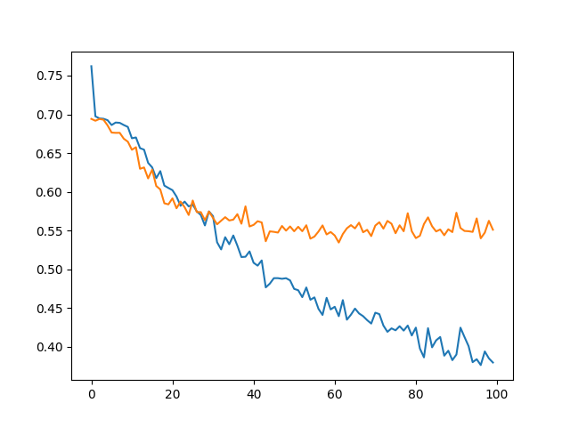
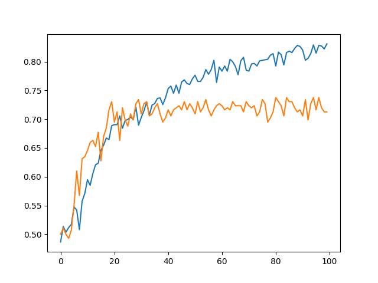
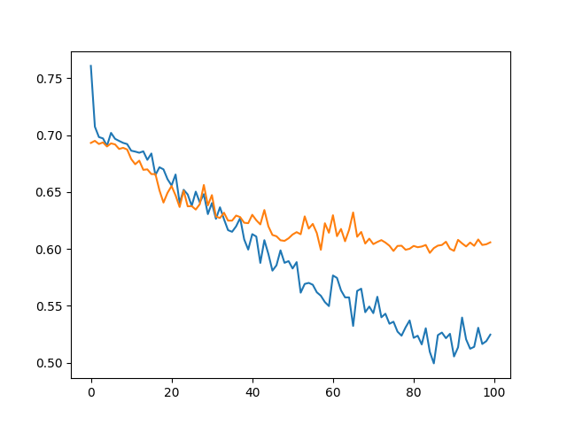
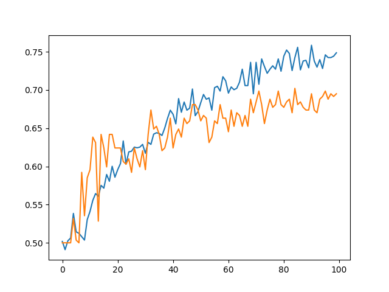

# 图像分类任务：猫和狗

**数据集：** https://gitcode.com/open-source-toolkit/ef827/blob/main

* 结果1
[!png][png]
[!png][png]
**过拟合**
改进：
* 结果2
[!png][png]
[!png][png]
四张图片的预测结果：
~~~text
/home/jack/python project/pic_classify/cat.jpg | 预测结果：猫 | 预测概率：0.7407 (74.07%)
/home/jack/python project/pic_classify/cat1.jpg | 预测结果：猫 | 预测概率：0.8206 (82.06%)
/home/jack/python project/pic_classify/dog.jpg | 预测结果：狗 | 预测概率：0.6670 (66.70%)
/home/jack/python project/pic_classify/dog1.jpg | 预测结果：猫 | 预测概率：0.6131 (61.31%)
~~~
